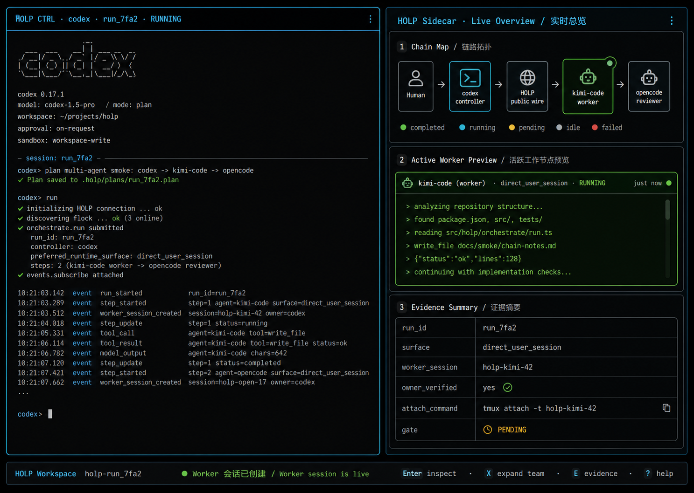
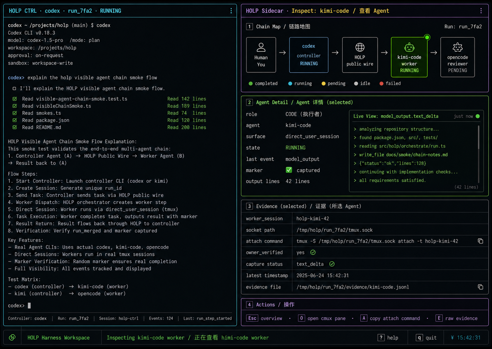
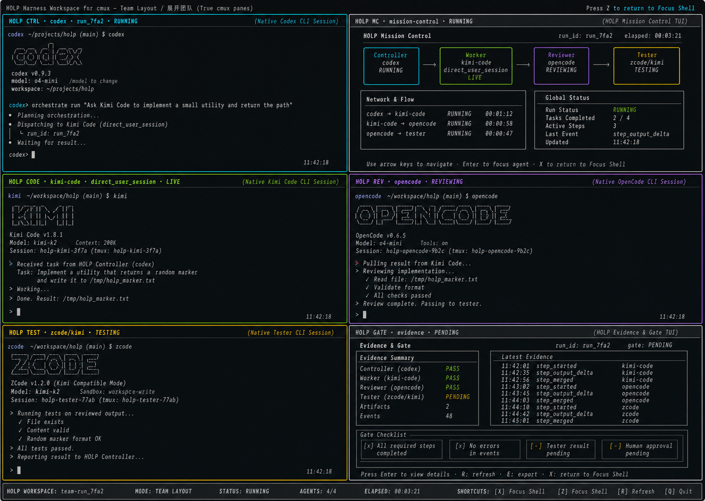

# Issue #66 - HOLP Harness Workspace for cmux UX Design Note

## Status

> **Status: reference-consumer UX design note. Non-normative, non-core,
> non-protocol.**
> This document describes how a terminal consumer *could* present HOLP. It
> changes **no** HOLP public wire, runtime selection, adapter, or readiness
> state. It is **not** part of the #45 execution chain
> (`#46 -> #47 -> #48 -> #49 -> #50 -> #51 -> #54 -> #52`) and advances
> **no** gate, including #41 data-sufficiency. cmux remains
> **`cmux-pending-user-validation`**; nothing here claims
> `terminal-consumer-integration-ready` or `cmux-ready`. The live agent view is
> the public `model_output.text_delta` event stream, **not** tmux attach (see
> #65). cmux's own UI state stays outside HOLP core.

This note follows #63 and #65. #63 proved a visible multi-agent chain smoke;
#65 made a `direct_user_session` worker observable and attachable as a substrate.
This document only defines the reference-consumer UX target that a future cmux
consumer could use to make that chain understandable to a human.

## Product Model

HOLP should not redraw Agent CLIs into a new chat app. A terminal consumer should
let the human keep using a native Agent CLI while HOLP frames that CLI with
identity, state, evidence, and chain context.

The reference UX has two layers:

1. **Focus Shell**: the default working surface.
2. **Team Layout**: a cmux-expanded surface with real panes for multiple agents.

The Focus Shell has two states:

- **Overview**: live chain summary, worker preview, evidence summary.
- **Inspect(agent)**: a Sidecar drill-down into one selected agent.

Overview and Inspect are states of the same shell. They must not feel like two
different products.

## Focus Shell

The Focus Shell is the default experience.

- Left: a complete native Controller Agent CLI, such as Codex, preserved as-is.
- Right: a HOLP Sidecar with chain, worker, evidence, and gate context.
- Bottom: a shared status and shortcut bar.

The Agent CLI pane may have thin harness chrome: role, agent, run id, runtime
surface, state, and a subtle role accent. The harness chrome must not replace
the native CLI's prompt, output, shortcuts, or terminal behavior.

### Overview

In Overview, the Sidecar shows:

- chain map: human -> controller -> HOLP public wire -> worker/reviewer/tester;
- active worker preview from `model_output.text_delta`;
- evidence summary: `run_id`, runtime surface, worker session, owner proof,
  latest event, and gate state;
- human-readable status in `zh-CN` or `en-US`.

### Inspect(agent)

Inspect is entered by selecting an agent from the Sidecar and pressing Enter. It
does not create a new cmux pane.

In Inspect, the shell remains stable:

- the left Controller CLI stays visible and native;
- the chain map remains visible with the selected agent highlighted;
- the middle Sidecar area changes from preview to selected-agent detail;
- evidence is scoped to the selected agent;
- Esc returns to Overview.

Inspect should use the same headers, spacing, borders, status bar, and role
colors as Overview. The user should understand that this is a drill-down from the
same interface.

## Team Layout

Team Layout is a cmux workspace expansion, not a TUI illusion.

Each Agent CLI must be a complete independent cmux pane or surface:

- Controller pane: native controller CLI.
- Worker pane: native worker CLI.
- Reviewer pane: native reviewer CLI, when present.
- Tester pane: native tester CLI, when present.
- Mission Control pane: chain and run-level status.
- Evidence/Gate pane: gate report, evidence, and failure explanation.

A single TUI must not pretend to contain multiple real Agent CLI panes. If the
human chooses to expand the team, cmux owns the spatial layout.

## Role Skins

Role skins are visual mappings only. They are not new protocol roles.

| Skin | Visual color | Meaning | Canonical source |
| --- | --- | --- | --- |
| `CTRL` | Blue / cyan | Driving controller agent | #63 controller concept; not a protocol role |
| `CODE` | Green | Implementation worker | `coder` |
| `TEST` | Yellow / amber | Test execution or test audit | `tester`, `test_audit`, `test_strengthen` |
| `REV` | Purple | Review agent | `reviewer` |
| `ARCH` | Orange | Architecture review | `architect` |
| `GATE` | Gray plus state color | Gate/evidence surface | Gate report and governance evidence; not a protocol role |

Consumers may choose different colors for accessibility, but they should preserve
the role distinctions.

## Language Rules

Human explanations, panel titles, failure summaries, and hints may be localized
to `zh-CN` and `en-US`.

Do not translate protocol or diagnostic anchors:

- wire methods: `initialize`, `flock.declare`, `flock.discover`,
  `orchestrate.run`, `events.subscribe`, `approval.resolve`, `task.cancel`;
- runtime and field names: `run_id`, `direct_user_session`,
  `preferred_runtime_surface`, `model_output.text_delta`, `full_text`,
  `worker_session`, `owner_verified`;
- event names such as `run_merged`, `run_gave_up`, `consensus_verdict`,
  `consensus_degraded`, `gate_report`, `approval_requested`,
  `approval_resolved`, `step_started`;
- terminal and reason tokens such as `run_cancelled`;
- commands, paths, socket names, and attach/kill commands.

This keeps the UI friendly without breaking debugging and evidence correlation.

## cmux Behavior

Any future cmux implementation must follow non-disruptive workspace behavior:

- default to the caller workspace;
- build layout additively;
- do not speculatively focus panes, select workspaces, close user panes, or move
  user surfaces;
- Team Layout may create real panes only when the user asks for expansion;
- helper panes should be reusable and clearly associated with the current HOLP
  run.

The reference UX may show attach commands, but for the cmux target the live
consumer path is `model_output.text_delta` over HOLP public wire. #65 documents
that standard tmux attach is not the reliable cmux-side observation path.

## Candidate Follow-Up PRs

These are candidate implementation slices, not committed architecture decisions:

1. **Sidecar state model**: define the consumer-side state derived from HOLP
   public wire for Overview and Inspect.
2. **Sidecar TUI prototype**: implement the right-side Sidecar and Evidence view.
   Charmbracelet / Bubble Tea / Lip Gloss is the current visual preference, but
   TS-vs-Go is an open implementation decision for that future PR.
3. **cmux Team Layout integration**: create real cmux panes for expanded teams
   without stealing focus or mutating unrelated user panes.
4. **Operator controls and replay**: add attach helpers, cancel/interrupt/rerun
   controls, and replay/demo mode after observation UX is stable.

Each implementation PR must write its own per-PR spec from then-current `main`.

## Non-Goals

- Do not change HOLP public wire.
- Do not add protocol events or fields.
- Do not add a Go module or TUI implementation in this PR.
- Do not implement a cmux, Warp, Happier, or terminal-product adapter.
- Do not claim `terminal-consumer-integration-ready`.
- Do not claim `cmux-ready`.
- Do not unblock #41 data sufficiency or #36 learned-active readiness.
